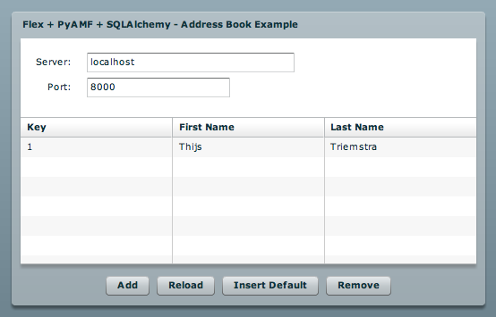

***************
  Addressbook
***************

.. topic:: Introduction

   This page describes how to setup the Addressbook example application
   using the `Flex SDK`_ and SQLAlchemy_.

   This example demonstrates loading and saving persistent objects with
   lazy-loaded values.

   Check the :doc:`SQLAlchemy Adapter<../gateways/sqlalchemy>` page for
   more info on using SQLAlchemy with PyAMF.

   A live demo can be found on the PyAMF blog_.

.. contents::

Download
========

Clone the PyAMF repository with:

.. code-block:: bash

    git clone git://github.com/hydralabs/pyamf.git pyamf
    cd doc/tutorials/examples/actionscript/addressbook-example/python

Alternatively, if you just want to have a look, you can browse_ the example online.

Gateway
=======

**Note**: make sure you have SQLAlchemy_ >= 0.4 installed.

The remoting gateway for the Adobe Flash Player and Python AMF clients starts on
http://localhost:8000 when you launch the `development server`_:

.. code-block:: bash

    python server.py

You should see something like:

.. code-block:: bash

    Running SQLAlchemy AMF gateway on http://localhost:8000
    Press Ctrl-c to stop server.

Options
-------

When you run `python server.py --help` it will display the various options available
for this example server:

.. code-block:: bash

    Usage: server.py [options]

    Options:
      -h, --help            show this help message and exit
      -p PORT, --port=PORT  port number [default: 8000]
      --host=HOST           host address [default: localhost]

Clients
=======

Flash Player
------------

You can simply open the `SWF file`_ and it will connect to http://localhost:8000.

Python
------

The Python AMF client can be started by running the following from the `python`
folder:

.. code-block:: bash

    python client.py

You should see something like this for the client:

.. code-block:: bash

    Added user: Bill Lumbergh
    Load users:
	1. Bill (2009-12-26 19:45:22.522754)

And the server prints:

.. code-block:: bash

    2009-12-26 20:45:22,470 DEBUG [root] remoting.decode start
    2009-12-26 20:45:22,471 DEBUG [root] Remoting target: u'ExampleService.insertDefaultData'
    2009-12-26 20:45:22,471 DEBUG [root] remoting.decode end
    2009-12-26 20:45:22,472 DEBUG [root] AMF Request: <Envelope amfVersion=0>
     (u'/1', <Request target=u'ExampleService.insertDefaultData'>[]</Request>)
    </Envelope>
    2009-12-26 20:45:22,536 DEBUG [root] AMF Response: <Envelope amfVersion=0>
     (u'/1', <Response status=/onResult>u'Added user: Bill Lumbergh'</Response>)
    </Envelope>
    localhost - - [26/Dec/2009 20:45:22] "POST / HTTP/1.1" 200 57
    2009-12-26 20:45:22,541 DEBUG [root] remoting.decode start
    2009-12-26 20:45:22,541 DEBUG [root] Remoting target: u'ExampleService.loadAll'
    2009-12-26 20:45:22,541 DEBUG [root] remoting.decode end
    2009-12-26 20:45:22,541 DEBUG [root] AMF Request: <Envelope amfVersion=0>
     (u'/2', <Request target=u'ExampleService.loadAll'>[u'org.pyamf.examples.addressbook.models.User']</Request>)
    </Envelope>
    2009-12-26 20:45:22,545 DEBUG [root] AMF Response: <Envelope amfVersion=0>
     (u'/2', <Response status=/onResult>[<models.User object at 0x10285c750>]</Response>)
    </Envelope>
    localhost - - [26/Dec/2009 20:45:22] "POST / HTTP/1.1" 200 865

Options
_______

When you run `python client.py --help` it will display the various options available
for this example client:

.. code-block:: bash

    Usage: client.py [options]

    Options:
      -h, --help            show this help message and exit
      -p PORT, --port=PORT  port number [default: 8000]
      --host=HOST           host address [default: localhost]

.. _Flex SDK: http://opensource.adobe.com/wiki/display/flexsdk/Flex+SDK
.. _SQLAlchemy: http://www.sqlalchemy.org
.. _blog: http://blog.pyamf.org/2009/03/sqlalchemy-and-flash-addressbook-example
.. _browse: http://github.com/hydralabs/pyamf/tree/master/doc/tutorials/examples/actionscript/addressbook
.. _development server: http://github.com/hydralabs/pyamf/tree/master/doc/tutorials/examples/actionscript/addressbook/python/server.py
.. _SWF file: http://github.com/hydralabs/pyamf/tree/master/doc/tutorials/examples/actionscript/addressbook/flex/deploy/sa_example.swf
