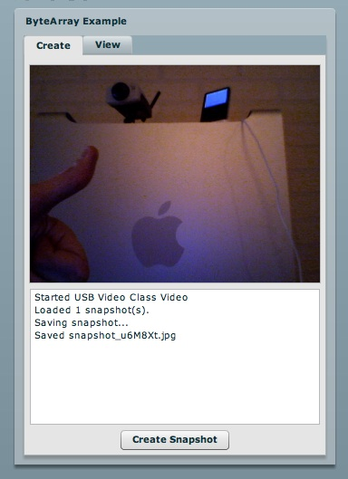

*************
  ByteArray
*************

.. topic:: Introduction

   This page describes how to setup the `ByteArray` example application
   using the `Flex SDK`_ and :doc:`Django <../gateways/django>`.

   The `ByteArray` class in Actionscript 3.0 provides methods and
   properties to optimize reading, writing, and working with binary
   data used in the Adobe Flash Player 9 and newer.

.. contents::

Overview
========

This example demonstrates how to:

- Create a webcam snapshot by capturing the `BitmapData` using Flex
- Wrap the image data with the `ByteArray` class and send it to a PyAMF
  remoting gateway
- Use Python_ to write the JPG file to disk
- Run a simple webserver for static content that serves the JPG files
- Use Flex to load the JPG and display it in the application

A live demo can be found on the PyAMF blog_.

Download
========

Clone the PyAMF repository with:

.. code-block:: bash

    git clone git://github.com/hydralabs/pyamf.git pyamf
    cd doc/tutorials/examples/actionscript/bytearray/python

Alternatively, if you just want to have a look, you can browse_ the example online.

Gateway
=======

**Note**: Make sure you have Django_ >= 1.0 installed.

The remoting gateway for the Adobe Flash Player and Python AMF clients starts on
http://127.0.0.1:8000 when you launch the `development server`_:

.. code-block:: bash

    python manage.py runserver

You should see something like:

.. code-block:: bash

    Validating models...
    0 errors found

    Django version 1.1.1, using settings 'python.settings'
    Development server is running at http://127.0.0.1:8000/
    Quit the server with CONTROL-C.

You can start the development server on a different host/port like this:

.. code-block:: bash

    python manage.py runserver 192.168.1.100:8080

Clients
=======

Flash Player
------------

You can simply open the `SWF file`_ and it will connect to http://localhost:8000.

Press the 'Create snapshot' button to make snapshots and save them to disk. You
can see the snapshots in the View tab. The snapshots are saved in the
`python/gateway/images` folder.

Python
------

The Python AMF client can be started by running the following from the `python`
folder:

.. code-block:: bash

    python client.py

You should see something like this for the client:

.. code-block:: bash

    Found 1 snapshot(s):
	http://127.0.0.1:8000/images/django-logo.jpg
    Saved snapshot:
	snapshot_x_M527.jpg:	http://127.0.0.1:8000/images/snapshot_x_M527.jpg

And the server prints:

.. code-block:: bash

    [2009-12-26 14:08:15,023 root DEBUG] remoting.decode start
    [2009-12-26 14:08:15,024 root DEBUG] Remoting target: u'getSnapshots'
    [2009-12-26 14:08:15,024 root DEBUG] remoting.decode end
    [2009-12-26 14:08:15,024 root DEBUG] AMF Request: <Envelope amfVersion=0>
      (u'/1', <Request target=u'getSnapshots'>[]</Request>)
    </Envelope>
    [2009-12-26 14:08:15,026 root DEBUG] AMF Response: <Envelope amfVersion=0>
      (u'/1', <Response status=/onResult>['http://127.0.0.1:8000/images/', ['jpg', 'png'],
    <flex.messaging.io.ArrayCollection [{'name': 'django-logo.jpg'}]>]</Response>)
    </Envelope>
    [26/Dec/2009 14:08:15] "POST / HTTP/1.1" 200 149
    [2009-12-26 14:08:15,032 root DEBUG] remoting.decode start
    [2009-12-26 14:08:15,033 root DEBUG] Remoting target: u'ByteArray.saveSnapshot'
    [2009-12-26 14:08:15,033 root DEBUG] remoting.decode end
    [2009-12-26 14:08:15,033 root DEBUG] AMF Request: <Envelope amfVersion=0>
     (u'/2', <Request target=u'ByteArray.saveSnapshot'>
             [<pyamf.amf3.ByteArray object at 0x102266c08>, u'jpg']</Request>)
    </Envelope>
    [2009-12-26 14:08:15,034 root DEBUG] AMF Response: <Envelope amfVersion=0>
     (u'/2', <Response status=/onResult>{'url': u'http://127.0.0.1:8000/images/snapshot_x_M527.jpg',
                                         'name': u'snapshot_x_M527.jpg'}</Response>)
    </Envelope>

Options
_______

When you run `python client.py --help` it will display the various options available
for this example client:

.. code-block:: bash

    Usage: client.py [options]

    Options:
      -h, --help            show this help message and exit
      -p PORT, --port=PORT  port number [default: 8000]
      --host=HOST           host address [default: 127.0.0.1]

.. _Flex SDK: http://opensource.adobe.com/wiki/display/flexsdk/Flex+SDK
.. _Django: http://djangoproject.com
.. _Python: http://python.org
.. _blog: http://blog.pyamf.org/2008/01/bytearray-example
.. _browse: http://github.com/hydralabs/pyamf/tree/master/doc/tutorials/examples/actionscript/bytearray
.. _development server: http://github.com/hydralabs/pyamf/tree/master/doc/tutorials/examples/actionscript/bytearray/python/manage.py
.. _SWF file: http://github.com/hydralabs/pyamf/tree/master/doc/tutorials/examples/actionscript/bytearray/flex/deploy/bytearray.swf

