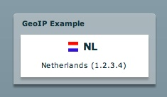

*********
  GeoIP
*********

.. topic:: Introduction

   This page describes how to setup the GeoIP example application.

   This example uses the open source `GeoIP APIs`_ for looking up
   the location of an IP address. The API includes support for lookup
   of country, region, city, latitude, and longitude.

   A live demo can be found on the PyAMF blog_.

.. contents::

Download
========

Clone the PyAMF repository with:

.. code-block:: bash

    git clone git://github.com/hydralabs/pyamf.git pyamf
    cd doc/tutorials/examples/actionscript/geoip/python

Alternatively, if you just want to have a look, you can browse_ the example online.

Gateway
=======

**Note**: Make sure you have the Maxmind `GeoIP API for Python`_ installed.

The remoting gateway for the Adobe Flash Player and Python AMF clients starts on
http://localhost:8000 when you launch the `development server`_ from the
`python` folder:

.. code-block:: bash

    python server.py

You should see something like this:

.. code-block:: bash

    Running GeoIP AMF gateway on http://localhost:8000

Options
-------

When you run `python server.py --help` it will display the various options available
for this example server:

.. code-block:: bash

    Usage: server.py [options]

    Options:
      -h, --help            show this help message and exit
      -p PORT, --port=PORT  port number [default: 8000]
      --host=HOST           host address [default: localhost]

Client
======

Flash Player
------------

You can simply open the `SWF file`_ and it will connect to http://localhost:8000.

Python
------

The Python AMF client can be started by running the following from the `python`
folder:

.. code-block:: bash

    python client.py

You should see something like this for the client:

.. code-block:: bash

    2009-12-26 21:35:44,659 DEBUG [root] Connecting to http://localhost:8000
    2009-12-26 21:35:44,659 DEBUG [root] Referer: None
    2009-12-26 21:35:44,659 DEBUG [root] User-Agent: PyAMF/0.5.1
    2009-12-26 21:35:44,659 DEBUG [root] Adding request geoip.getGeoInfo()
    2009-12-26 21:35:44,659 DEBUG [root] Executing single request: /1
    2009-12-26 21:35:44,659 DEBUG [root] AMF version: 0
    2009-12-26 21:35:44,663 DEBUG [root] Sending POST request to
    2009-12-26 21:35:44,665 DEBUG [root] Waiting for response...
    2009-12-26 21:35:44,672 DEBUG [root] Got response status: 200
    2009-12-26 21:35:44,672 DEBUG [root] Content-Type: application/x-amf
    2009-12-26 21:35:44,672 DEBUG [root] Content-Length: 110
    2009-12-26 21:35:44,672 DEBUG [root] Server: PyAMF/0.5.1 CPython/2.6.4
    2009-12-26 21:35:44,673 DEBUG [root] Read 110 bytes for the response
    2009-12-26 21:35:44,673 DEBUG [root] Response: <Envelope amfVersion=0>
     (u'/1', <Response status=/onResult>
                <GeoInfo country={'code': None, 'name': None} ip=127.0.0.1>
             </Response>)
    </Envelope>
    2009-12-26 21:35:44,673 DEBUG [root] Removing request: /1
    <GeoInfo country={'code': None, 'name': None} ip=127.0.0.1>

Options
_______

When you run `python client.py --help` it will display the various options available
for this example client:

.. code-block:: bash

    Usage: client.py [options]

    Options:
      -h, --help            show this help message and exit
      -p PORT, --port=PORT  port number [default: 8000]
      --host=HOST           host address [default: localhost]

.. _GeoIP APIs: http://sourceforge.net/projects/geoip
.. _GeoIP API for Python: http://www.maxmind.com/app/python
.. _Python: http://python.org
.. _blog: http://blog.pyamf.org/2008/01/geoip-example
.. _browse: http://github.com/hydralabs/pyamf/tree/master/doc/tutorials/examples/actionscript/geoip
.. _development server: http://github.com/hydralabs/pyamf/tree/master/doc/tutorials/examples/actionscript/geoip/python/server.py
.. _SWF file: http://github.com/hydralabs/pyamf/tree/master/doc/tutorials/examples/actionscript/geoip/flex/deploy/geoip.swf
