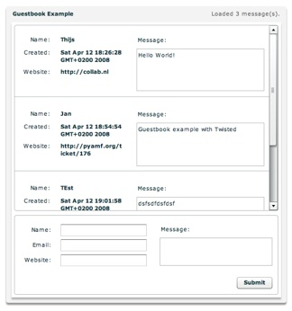

*************
  Guestbook
*************

.. topic:: Introduction

   This example shows how to create a simple guestbook application using
   :doc:`../gateways/twisted` and the `Flex SDK`_.

   A live demo can be found on the PyAMF blog_.

.. contents::

Download
========

Clone the PyAMF repository with:

.. code-block:: bash

    git clone git://github.com/hydralabs/pyamf.git pyamf
    cd doc/tutorials/examples/actionscript/guestbook

Alternatively, if you just want to have a look, you can browse_ the example online.

Database
========

**Note**: make sure you have Twisted_, MySQL-Python_ and MySQL_ installed.

This example uses a MySQL setup with a database called 'guestbook'. The `schema file`_
is included that you need to run on your database first.
The database host/username/password settings can be found in the `config file`_.

Gateway
=======

The remoting gateway for the Adobe Flash Player and other AMF clients starts on
http://localhost:8080 when you launch the `development server`_:

.. code-block:: bash

    twistd -noy guestbook.tac

You should see something like:

.. code-block:: bash

    2008-04-12 15:12:14+0200 [-] Log opened.
    2008-04-12 15:12:14+0200 [-] twistd 8.0.1+r23300 (/usr/local/bin/python2.5 2.5.2) starting up
    2008-04-12 15:12:14+0200 [-] reactor class: <class 'twisted.internet.selectreactor.SelectReactor'>
    2008-04-12 15:12:14+0200 [-] twisted.web.server.Site starting on 8080
    2008-04-12 15:12:14+0200 [-] Starting factory <twisted.web.server.Site instance at 0x12efb48>

Clients
=======

Flash Player
------------

You can simply open the `SWF file`_ and it will connect to http://localhost:8080.

Python
------

The Python AMF client can be started by running the following from the `python`
folder:

.. code-block:: bash

    python client.py

Options
_______

When you run `python client.py --help` it will display the various options available
for this example client:

.. code-block:: bash

    Usage: client.py [options]

    Options:
      -h, --help            show this help message and exit
      -p PORT, --port=PORT  port number [default: 8000]
      --host=HOST           host address [default: localhost]

.. _Flex SDK: http://opensource.adobe.com/wiki/display/flexsdk/Flex+SDK
.. _Twisted: http://twistedmatrix.com
.. _blog: http://blog.pyamf.org/2008/04/twisted-guestbook
.. _browse: http://github.com/hydralabs/pyamf/tree/master/doc/tutorials/examples/actionscript/guestbook
.. _development server: http://github.com/hydralabs/pyamf/tree/master/doc/tutorials/examples/actionscript/guestbook/python/guestbook.tac
.. _SWF file: http://github.com/hydralabs/pyamf/tree/master/doc/tutorials/examples/actionscript/guestbook/flex/deploy/guestbook.swf
.. _schema file: http://github.com/hydralabs/pyamf/tree/master/doc/tutorials/examples/actionscript/guestbook/db/schema.sql
.. _config file: http://github.com/hydralabs/pyamf/tree/master/doc/tutorials/examples/actionscript/guestbook/python/settings.cfg
.. _MySQL-Python: http://sourceforge.net/projects/mysql-python/
.. _MySQL: http://mysql.org
