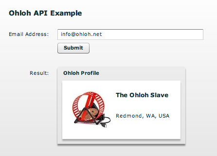

*********
  Ohloh
*********

.. topic:: Introduction

   Ohloh_ is a website which provides a web services suite and online community
   platform that aims to map the landscape of open source software development.

   The `Ohloh API`_ is a free, REST-based programming interface to the Ohloh
   open source directory. You can use the Ohloh API to create your own
   applications and web services based on Ohloh data.

   There is a live demo available on the PyAMF blog_.

.. contents::

Download
========

Clone the PyAMF repository with:

.. code-block:: bash

    git clone git://github.com/hydralabs/pyamf.git pyamf
    cd doc/tutorials/examples/actionscript/ohloh

Alternatively, if you just want to have a look at the source, you can
browse_ the example online.

Server
======

The WSGI server for the Adobe Flash Player and Python AMF clients starts on
http://localhost:8000 when you launch the `development server`_ from the `python`
folder:

.. code-block:: bash

    python server.py

**Note**: Make sure you replace the API key in ohloh.py_ with a valid one
that you can get for free when you sign up on the Ohloh website.

Options
-------

When you run `python server.py --help` it will display the various options available
for this example server:

.. code-block:: bash

    Usage: server.py [options]

    Options:
      -h, --help            show this help message and exit
      -p PORT, --port=PORT  port number [default: 8000]
      --host=HOST           host address [default: localhost]

Clients
=======

Use of one the following clients below to communicate with Ohloh.

More API examples are available on the `Ohloh website`_.

Flash Player
------------

You can simply open the `SWF file`_ and it will connect to
http://localhost:8000.

Python
------

The Python client allows you to query the Ohloh API and print the
result on stout. It requires you to enter the API key and it's
associated email address, like this:

.. code-block:: bash

    python client.py <api-key> <email-address>

When you run the client it should print the Ohloh account details
for that email address.

.. _Ohloh: http://www.ohloh.net
.. _Ohloh API: http://www.ohloh.net/api/getting_started
.. _blog: http://blog.pyamf.org/2008/04/26/ohloh-api-and-python
.. _browse: http://github.com/hydralabs/pyamf/tree/master/doc/tutorials/examples/actionscript/ohloh
.. _ohloh.py: http://github.com/hydralabs/pyamf/tree/master/doc/tutorials/examples/actionscript/ohloh/python/ohloh.py
.. _development server: http://github.com/hydralabs/pyamf/tree/master/doc/tutorials/examples/actionscript/bytearray/python/manage.py
.. _SWF file: http://github.com/hydralabs/pyamf/tree/master/doc/tutorials/examples/actionscript/ohloh/flex/deploy/ohloh.swf
.. _Ohloh website: http://www.ohloh.net/api/examples
