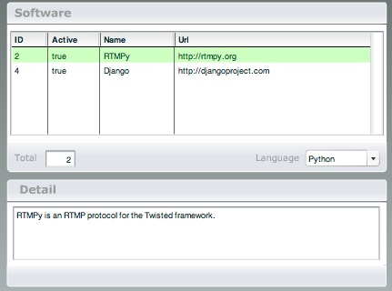

***************
  RecordSet
***************

.. topic:: Introduction

   This page describes how to setup the `RecordSet` Adobe Flash (MX 2004)
   example application.

.. contents::

Installation
============

First you need to install the free Flash Remoting components for
`Adobe Flash MX 2004`_ or `Flash 8.0`_.

If you want to use Flash Remoting for Actionscript 2.0 in Adobe Flash CS3
or newer, check this page_ for more info.

Also make sure you have SQLAlchemy_ >= 0.4 installed.

Download
========

Clone the PyAMF repository with:

.. code-block:: bash

    git clone git://github.com/hydralabs/pyamf.git pyamf
    cd doc/tutorials/examples/actionscript/recordset

Alternatively, if you just want to have a look, you can browse_ the example
online.

Database
========

For this example the records are stored in a SQLite_ database. To
generate the database file run::

    python init.py

You should see something like::

    Creating database...
    Creating tables...
    Successfully set up.

This created a file called `temp.db` in the folder where you
executed the command.

**Note**: When you change the database schema in `db.py` make
sure to delete the database file and run `init.py` again.

Gateway
=======

The remoting gateway for the Adobe Flash Player and Python AMF clients starts on
http://localhost:8000 when you launch the `development server`_::

    python gateway.py

You should see something like::

    Started RecordSet example server on http://localhost:8000

**Note**: When you decide not to use the default host or port you will need to
change the Actionscript and recompile the SWF as well.

Options
-------

When you run `python gateway.py --help` it will display the various options available
for this example server::

    Usage: gateway.py [options]

    Options:
      -h, --help            show this help message and exit
      -p PORT, --port=PORT  port number [default: 8000]
      --host=HOST           host address [default: localhost]

Clients
=======

Flash Player
------------

You can simply open the `SWF file`_ and it will connect to http://localhost:8000.

Python
------

The Python AMF client can be started by running the following from the `python`
folder::

    python client.py

You should see something like this for the client::

    2009-12-27 01:58:13,300 DEBUG [root] Connecting to http://localhost:8000
    2009-12-27 01:58:13,300 DEBUG [root] Referer: None
    2009-12-27 01:58:13,301 DEBUG [root] User-Agent: PyAMF/0.5.1
    2009-12-27 01:58:13,301 DEBUG [root] Adding request service.getLanguages()
    2009-12-27 01:58:13,301 DEBUG [root] Executing single request: /1
    2009-12-27 01:58:13,301 DEBUG [root] AMF version: 0
    2009-12-27 01:58:13,302 DEBUG [root] Sending POST request to
    2009-12-27 01:58:13,307 DEBUG [root] Waiting for response...
    2009-12-27 01:58:13,311 DEBUG [root] Got response status: 200
    2009-12-27 01:58:13,311 DEBUG [root] Content-Type: application/x-amf
    2009-12-27 01:58:13,311 DEBUG [root] Content-Length: 325
    2009-12-27 01:58:13,311 DEBUG [root] Server: PyAMF/0.5.1 CPython/2.6.4
    2009-12-27 01:58:13,311 DEBUG [root] Read 325 bytes for the response
    2009-12-27 01:58:13,312 DEBUG [root] Response: <Envelope amfVersion=0>
    (u'/1', <Response status=/onResult><pyamf.amf0.RecordSet object at 0x10063cc50></Response>)
    </Envelope>
    2009-12-27 01:58:13,312 DEBUG [root] Removing request: /1
    Result: <pyamf.amf0.RecordSet object at 0x10063cc50>

Options
_______

When you run `python client.py --help` it will display the various options available
for this example client::

    Usage: client.py [options]

    Options:
      -h, --help            show this help message and exit
      -p PORT, --port=PORT  port number [default: 8000]
      --host=HOST           host address [default: localhost]

.. _Adobe Flash MX 2004: http://www.adobe.com/products/flashremoting/downloads/components/#flr_as2
.. _Flash 8.0: http://www.adobe.com/products/flashremoting/downloads/components/#flr_fl81
.. _page: http://blog.vixiom.com/2007/04/17/actionscript-20-flash-remoting-with-flash-cs3/
.. _SQLAlchemy: http://www.sqlalchemy.org
.. _SQLite: http://sqlite.org
.. _browse: http://github.com/hydralabs/pyamf/tree/master/doc/tutorials/examples/actionscript/recordset
.. _development server: http://github.com/hydralabs/pyamf/tree/master/doc/tutorials/examples/actionscript/recordset/python/gateway.py
.. _SWF file: http://github.com/hydralabs/pyamf/tree/master/doc/tutorials/examples/actionscript/recordset/flash/SoftwareInfoExample.swf
