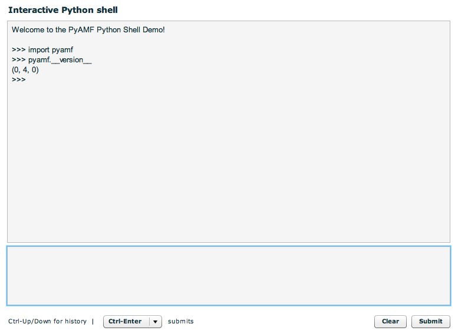

****************************
  Interactive Python Shell
****************************

.. topic:: Introduction

   This document describes how to setup the interactive, stateful Flex
   shell that runs Python code on the server using the Flex_ SDK,
   :doc:`Google App Engine<../gateways/appengine>` and
   :doc:`Django <../gateways/django>`.

.. contents::

We recommend you **don't** run this example on a production server because
it exposes major security risks. This example is for educational purposes ;)

A live demo can be found on the PyAMF `Google App Engine example page`_.

Download
========

Clone the PyAMF repository with:

.. code-block:: bash

    git clone git://github.com/hydralabs/pyamf.git pyamf
    cd doc/tutorials/examples/actionscript/shell

Alternatively, if you just want to have a look, you can browse_ the example online.

Setup
=====

**Note**: make sure you have Django_ >= 1.0 installed.

Database
--------

This example uses SQLite_ to provide session support. First initialise the database by running:

.. code-block:: bash

    python manage.py syncdb

Should output the following:

.. code-block:: bash

    Creating table django_content_type
    Creating table django_session

Gateway
=======

The remoting gateway for the Adobe Flash Player and Python AMF clients is available on
http://localhost:8000/gateway/shell/ when you launch the `development server`_:

.. code-block:: bash

    python manage.py runserver

You should see something like:

.. code-block:: bash

    Validating models...
    0 errors found

    Django version 1.1.1, using settings 'python.settings'
    Development server is running at http://127.0.0.1:8000/
    Quit the server with CONTROL-C.

Client
======

Flash Player
------------

You can simply open the `SWF file`_ and it will connect to http://localhost:8000.

Python
------

The Python AMF client can be started by running the following from the `python`
folder:

.. code-block:: bash

    python client.py

You should see something like this for the client:

.. code-block:: python

    Connecting to http://localhost:8000/gateway/shell/

    Welcome to the PyAMF 0.5.1 Shell Demo!
    Python 2.6.4 (r264:75706, Dec 22 2009, 21:55:52)
    [GCC 4.2.1 (Apple Inc. build 5646)] on darwin
    Type "help", "copyright", "credits" or "license" for more information.
    >>>

You can now use the interpreter as you normally would:

.. code-block:: python

    >>> import sys
    >>> sys.version
    '2.6.4 (r264:75706, Dec 22 2009, 21:55:52) \n[GCC 4.2.1 (Apple Inc. build 5646)]'

Options
_______

When you run `python client.py --help` it will display the various options available
for this example client:

.. code-block:: bash

    Usage: client.py [options]

    Options:
      -h, --help            show this help message and exit
      -p PORT, --port=PORT  port number [default: 8000]
      --host=HOST           host address [default: localhost]

.. _Flex: http://opensource.adobe.com/wiki/display/flexsdk/Flex+SDK
.. _Django: http://www.djangoproject.com
.. _Google App Engine example page: http://pyamf.appspot.com/shell
.. _browse: http://github.com/hydralabs/pyamf/tree/master/doc/tutorials/examples/actionscript/shell
.. _development server: http://github.com/hydralabs/pyamf/tree/master/doc/tutorials/examples/actionscript/shell/python/manage.py
.. _SQLite: http://sqlite.org
.. _SWF file: http://github.com/hydralabs/pyamf/tree/master/doc/tutorials/examples/actionscript/shell/flex/deploy/shell.swf
