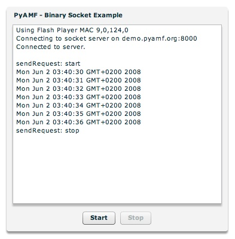

*****************
  Binary Socket
*****************

.. topic:: Introduction

   This page describes how to setup the `Socket` example application for
   PyAMF.

   The `Socket` class in Actionscript 3.0 enables Adobe Flash Player
   applications to make socket connections and to read and write raw
   binary data.

   The example server shows how to setup a `Socket` connection with the
   `Flex SDK`_ and exchange AMF data with a :doc:`../gateways/twisted`
   server.

   A live demo can be found on the PyAMF blog_.

.. contents::

Download
========

Clone the PyAMF repository with:

.. code-block:: bash

    git clone git://github.com/hydralabs/pyamf.git pyamf
    cd doc/tutorials/examples/actionscript/socket-example

Alternatively, if you just want to take a look at the source, you can
browse_ the example online.

Gateway
=======

**Note**: Make sure you have Twisted_ >= 2.5 installed.

The Twisted socket server for the Adobe Flash Player and Python AMF clients starts on
http://localhost:8000 when you run:

.. code-block:: bash

    twistd -noy timer.tac

You should see something like:

.. code-block:: bash

    2008-01-07 06:03:09+0100 [-] Log opened.
    2008-01-07 06:03:09+0100 [-] twistd 2.5.0 (../Python 2.5.1) starting up
    2008-01-07 06:03:09+0100 [-] reactor class: <class 'twisted.internet.selectreactor.SelectReactor'>
    2008-01-07 06:03:09+0100 [-] server.TimerFactory starting on 8000
    2008-01-07 06:03:09+0100 [-] Starting factory <server.TimerFactory instance at 0x1414af8>

You can stop the server by pressing Ctrl-c.

If you want to run the application as a Twisted daemon process, use this command instead:

.. code-block:: bash

    twistd -oy timer.tac

Clients
=======

Adobe Flash Player
------------------

You can simply open the `SWF file`_ and it will connect to http://localhost:8000.

Use the 'Start' and 'Stop' buttons to control the Python socket server that sends
the system time to the Flex application every second:

Python
------

The Python AMF client can be started by running the following from the `python`
folder:

.. code-block:: bash

    python client.py

The client will connect to the socket server on http://localhost:8000
and start sending messages:

.. code-block:: bash

    Connecting to socket server on localhost:8000
    Connected to server.

    send request: start
    2009-07-02 23:06:31.684023
    2009-07-02 23:06:32.684465
    2009-07-02 23:06:33.684923
    2009-07-02 23:06:34.685351
    2009-07-02 23:06:35.685828
    2009-07-02 23:06:36.686253
    send request: stop

Options
_______

When you run `python client.py --help` it will display the various options available
for this example client:

.. code-block:: bash

    Usage: client.py [options]

    Options:
      -h, --help            show this help message and exit
      -p PORT, --port=PORT  port number [default: 8000]
      --host=HOST           host address [default: localhost]

.. _Flex SDK: http://opensource.adobe.com/wiki/display/flexsdk/Flex+SDK
.. _Twisted: http://twistedmatrix.com
.. _Python: http://python.org
.. _blog: http://blog.pyamf.org/2008/01/socket-example
.. _browse: http://github.com/hydralabs/pyamf/tree/master/doc/tutorials/examples/actionscript/socket
.. _SWF file: http://github.com/hydralabs/pyamf/tree/master/doc/tutorials/examples/actionscript/socket/flex/deploy/socket.swf
.. _client: http://github.com/hydralabs/pyamf/tree/master/doc/tutorials/examples/actionscript/socket/python/client.py
