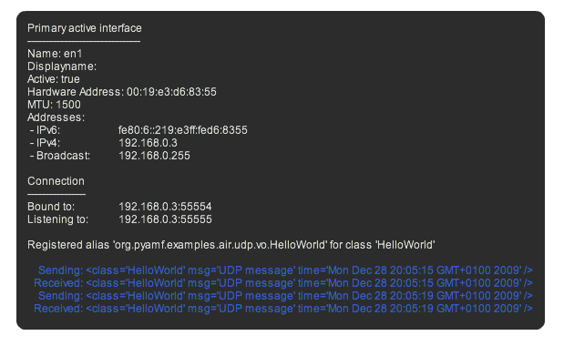
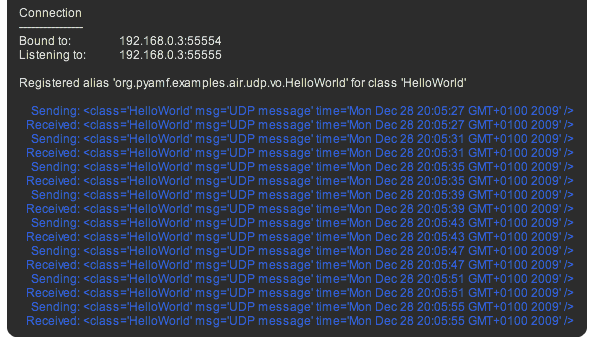
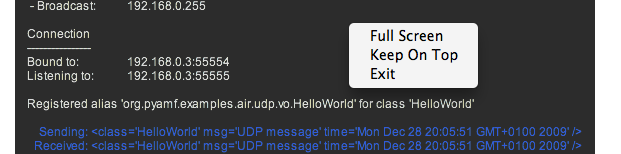

*******
  UDP
*******

.. topic:: Introduction

   This page describes how to setup the UDP example application
   using `Adobe AIR`_, PyAMF and Twisted_.

   Adobe AIR >= 2.0 supports `UDP sockets`_, allowing you to send
   and receive messages using the Universal Datagram Protocol (UDP).
   
   The example application shows you how to echo a typed object
   every x seconds and display the active hardware and software
   network interfaces that are available on the client computer.

.. contents::

Download
========

#. Download and install the Adobe AIR runtime_. Also download the
   Adobe AIR SDK_ if you want to modify and compile the application.

#. Clone the PyAMF repository with:

.. code-block:: bash

    git clone git://github.com/hydralabs/pyamf.git pyamf
    cd doc/tutorials/examples/actionscript/udp-example

Alternatively, if you just want to have a look, you can browse_ the example online.

Server
======

**Note**: Make sure you have Twisted_ >= 2.5 installed.

The UDP server for the Adobe Flash Player starts on localhost:55555 when you
launch the `development server`_:

.. code-block:: bash

    python server.py

You should see something like::

    Registered alias 'org.pyamf.examples.air.udp.vo.HelloWorld' for class 'HelloWorld'
    Server started listening on port 55555

Client
======

AIR
---

After you started the server you can simply install the `AIR file`_, launch it and
it will show you're connected to localhost:55555, i.e.:

The server terminal window shows it receiving and echoing back the `HelloWorld`
instances::

    Registered alias 'org.pyamf.examples.air.udp.vo.HelloWorld' for class 'HelloWorld'
    Server started listening on port 55555
    received <HelloWorld msg='UDP message' time=2009-12-28 19:36:53.370000 /> from 192.168.0.3:55554
    received <HelloWorld msg='UDP message' time=2009-12-28 19:36:57.418000 /> from 192.168.0.3:55554
    received <HelloWorld msg='UDP message' time=2009-12-28 19:37:01.418000 /> from 192.168.0.3:55554
    received <HelloWorld msg='UDP message' time=2009-12-28 19:37:05.417000 /> from 192.168.0.3:55554
    received <HelloWorld msg='UDP message' time=2009-12-28 19:37:09.417000 /> from 192.168.0.3:55554

Drag the window or resize it by dragging any of the sides or corners:

Right-click for the fullscreen and always on top options:

.. _Adobe AIR: http://www.adobe.com/products/air
.. _runtime: http://get.adobe.com/air
.. _SDK: http://www.adobe.com/go/air_sdk
.. _Twisted: http://twistedmatrix.com
.. _UDP sockets: http://help.adobe.com/en_US/FlashPlatform/reference/actionscript/3/flash/net/DatagramSocket.html
.. _browse: http://github.com/hydralabs/pyamf/tree/master/doc/tutorials/examples/actionscript/udp
.. _development server: http://github.com/hydralabs/pyamf/tree/master/doc/tutorials/examples/actionscript/udp/python/server.py
.. _AIR file: http://github.com/hydralabs/pyamf/tree/master/doc/tutorials/examples/actionscript/udp/air/deploy/udp.air
