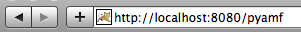

**********
  modjy 
**********

.. topic:: Introduction

   This howto shows you how to easily publish your PyAMF applications with
   `Apache Tomcat`_ and modjy_. modjy is an implementation of a WSGI
   compliant gateway/server for Jython_, built on Java/J2EE servlets. This
   allows you to run Jython WSGI applications inside a Java/J2EE servlet
   container, e.g. Apache Tomcat. modjy is part of the Jython project.

   We're going to assume you downloaded Apache Tomcat and are able to run
   it on ``http://localhost:8080``, which is the default for Tomcat.
   Flash applications will be able to access your PyAMF remoting gateway
   on ``http://localhost:8080/pyamf/``.

   This was tested with Jython_ 2.5, `Apache Tomcat`_ 6.0.20, and Java 1.6
   on Mac OS X 10.5.7. 

.. contents::

Deploying modjy
===============

Start by simply taking a copy of the ``modjy_webapp`` directory in the
``Demo`` subdirectory of the Jython distribution, and drop it in the
location where your container expects to find web applications.

The default installation of Apache Tomcat 6 has a subdirectory called
``webapps``. If you're running Tomcat 6, simply drop the ``modjy_webapp``
directory in there and rename it to ``pyamf``:

.. code-block:: bash

   cd apache-tomcat-6.0.20
   cp -R /path/to/jython2.5.0/Demo/modjy_webapp webapps/pyamf

If you're using a different J2EE container, or a non-default installation
of Tomcat, you'll need to read your container documentation to find out
where web applications should live.

Now place the ``jython.jar`` file in the servlet container hierarchy so
that it is available when the modjy servlet class is being loaded.
Standard J2EE classloading behaviour when looking for support resources
is to look first inside the ``WEB-INF/lib`` directory for a web
application, so place the ``jython.jar`` file in there:

.. code-block:: bash
   
   cp -R /path/to/jython2.5.0/jython.jar webapps/pyamf/WEB-INF/lib

Modify the ``webapps/pyamf/WEB-INF/web.xml`` file so it contains:

.. literalinclude:: ../examples/jython/web.xml
   :language: xml
   :linenos:

Make sure you replace ``python.home`` in the example ``web.xml`` above
(see line 17) and point in to your local Jython installation.

Start Server
============

Now start Tomcat::
  
  bin/startup.sh

Browse to http://localhost:8080/pyamf/ where you should see Jython
is up and running::

 Modjy servlet running correctly: jython 2.5.0 (Release_2_5_0:6476, Jun 16 2009, 13:33:26)
 [Java HotSpot(TM) 64-Bit Server VM (Apple Inc.)] on java1.6.0_13

Create your PyAMF application
=============================

First drop a copy of the ``pyamf`` source folder in
``webapps/pyamf/WEB-INF/lib-python``::

  cp -R /path/to/pyamf-0.5.1/pyamf webapps/pyamf/WEB-INF/lib-python

Open ``webapps/pyamf/demo_app.py`` and replace it's contents with:

.. literalinclude:: ../examples/jython/demo_app.py
   :linenos:

That's it! Your Adobe Flash Player and AMF clients will now be able to
access your PyAMF application through http://localhost:8080/pyamf.

You don't have to restart the Apache Tomcat server when you make changes
to your application since the auto-reload mechanism is enabled by default.

Client
======

You can test the application with this Python AMF client:

.. literalinclude:: ../examples/jython/client.py
   :linenos:

References
==========

http://opensource.xhaus.com/projects/1/wiki/ModjyDeployment
  In-depth information about deploying modjy web applications

.. _Apache Tomcat: http://tomcat.apache.org
.. _modjy: http://opensource.xhaus.com/projects/modjy/wiki
.. _Jython: http://jython.org
