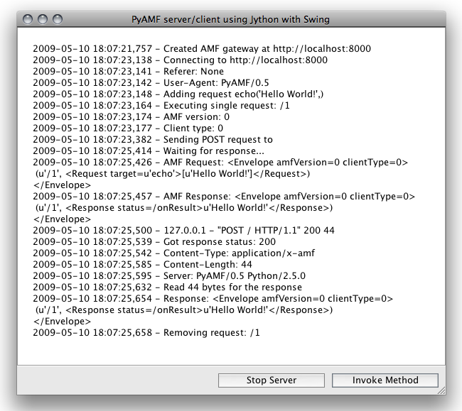

**********
  Swing 
**********

.. topic:: Introduction

    This howto describes how to setup the Swing_ example application
    using Jython_ 2.5 and newer.

.. contents::

Download
========

Grab the example from Git with:

.. code-block:: bash
 
   git clone git://github.com/hydralabs/pyamf.git
   cd pyamf/doc/tutorials/examples/jython/swing

Alternatively, if you just want to have a look, you can browse
the example online_.

Run Application
===============

The Swing application contains a AMF client and server that
starts on http://localhost:8000 when you run the ``gui.py``
file:

.. code-block:: bash

  jython gui.py

Use the ``Start Server`` button to launch the server and make
AMF client calls using the ``Invoke Method`` button.

Client
======

The Python AMF client can be started by running the following from the `jython`
folder:

.. code-block:: bash

    jython client.py

You should see something like this for the client:

.. code-block:: python

    Hello World!

Options
_______

When you run `jython client.py --help` it will display the various options available
for this example client:

.. code-block:: bash

    Usage: client.py [options]

    Options:
      -h, --help            show this help message and exit
      -p PORT, --port=PORT  port number [default: 8000]
      --host=HOST           host address [default: localhost]

.. _Swing: http://en.wikipedia.org/wiki/Swing_(Java)
.. _Jython: http://jython.org
.. _online: http://github.com/hydralabs/pyamf/tree/master/doc/tutorials/examples/jython/swing
